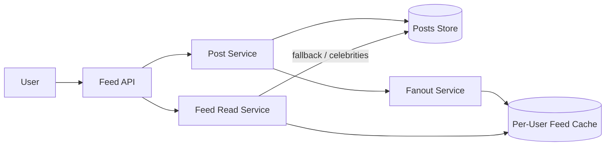
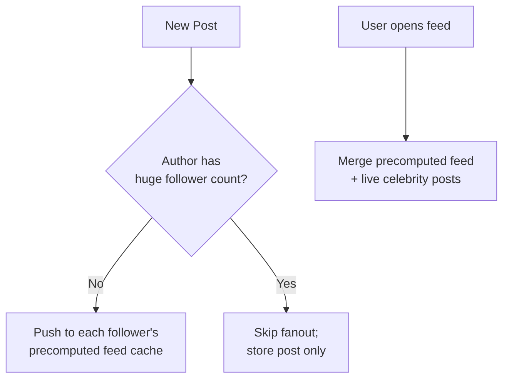
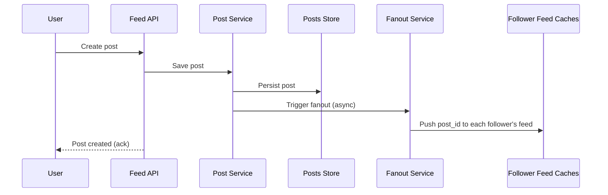
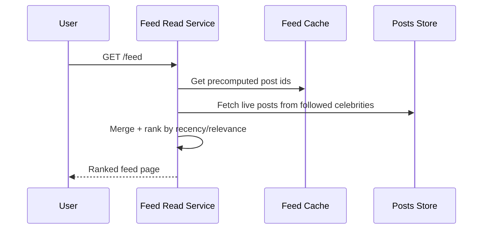

# Design a News Feed System

A news feed system aggregates posts from people/pages a user follows into a single, ranked, scrollable timeline.

In system design interviews, this question tests your ability to reason about fan-out strategies, handling "celebrity" accounts with huge follower counts, and balancing write cost against read latency.

## 1. Problem Statement

Design a system like the Facebook or Twitter/X feed that:

- lets users post content
- lets users follow other users/pages
- shows each user a feed of recent posts from who they follow, ideally ranked by relevance

## 2. Functional Requirements

- Create a post.
- Follow/unfollow users.
- Fetch a user's feed (paginated).
- Feed reflects new posts with reasonably low delay.

## 3. Non-Functional Requirements

- Feed reads must be fast (feed is opened far more often than posts are created).
- Must handle "celebrity" accounts with millions of followers without collapsing the system.
- Eventual consistency for feed freshness is acceptable (a few seconds delay is fine).

## 4. High-Level Architecture

## 5. Fan-out Strategies

### Fan-out-on-write (push model)

When a user posts, immediately push the post into the precomputed feed cache of every follower.

- Pros: feed reads are extremely fast (just read a precomputed list).
- Cons: a celebrity with 50M followers triggers 50M cache writes per post — very expensive.

### Fan-out-on-read (pull model)

Feed is computed at read time by merging recent posts from everyone the user follows.

- Pros: cheap writes, no wasted work for posts nobody reads.
- Cons: reads are expensive — must merge many sources on every feed open.

### Hybrid Approach (used in practice)

- Regular users: fan-out-on-write (push to follower feed caches).
- Celebrity accounts: fan-out-on-read — followers merge celebrity posts in at read time instead of pre-pushing.

## 6. Post Creation Flow

Fanout happens asynchronously via a queue so post creation stays fast even if a user has many followers.

## 7. Feed Read Flow

## 8. Data Model

- **Posts table**: `post_id`, `author_id`, `content`, `created_at`.
- **Follow graph**: `follower_id` -> `followee_id` (or reverse index for fast follower lookups).
- **Feed cache**: per-user list of `post_id`s (e.g., a Redis sorted set keyed by `user_id`, scored by post timestamp).

## 9. Ranking (Optional Enhancement)

Beyond pure recency, feeds are often ranked using a scoring service that weighs recency, engagement (likes/comments), and affinity (how often the user interacts with that author) — usually a separate ranking/ML service consuming the same candidate post set.

## 10. Scalability Considerations

- Feed caches are sharded by `user_id` across a cache cluster.
- Fanout workers scale horizontally and process the fanout queue asynchronously.
- Cap feed cache size per user (e.g., last 1,000 posts) and page further history from the DB if needed.

## 11. Tradeoffs

- Push model: fast reads, expensive/wasteful writes for high-fanout accounts.
- Pull model: cheap writes, slower reads.
- Hybrid model adds complexity but is the practical answer used by every major social platform.

## 12. Common Mistakes

- Applying pure fan-out-on-write to all accounts (breaks on celebrity posts).
- Recomputing the entire feed synchronously from the follow graph on every read.
- No pagination or cap on feed cache size, causing unbounded memory growth.
- Ignoring eventual consistency — trying to make the feed strongly consistent adds needless complexity.

## 13. Summary

A news feed system is fundamentally a tradeoff between fast reads and expensive writes. The hybrid fan-out approach — push for normal users, pull-and-merge for celebrities — is the standard solution that keeps both post creation and feed reads fast at any scale.
