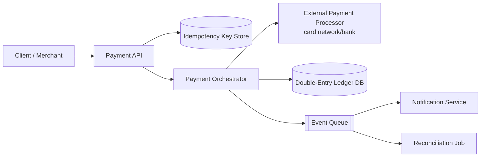
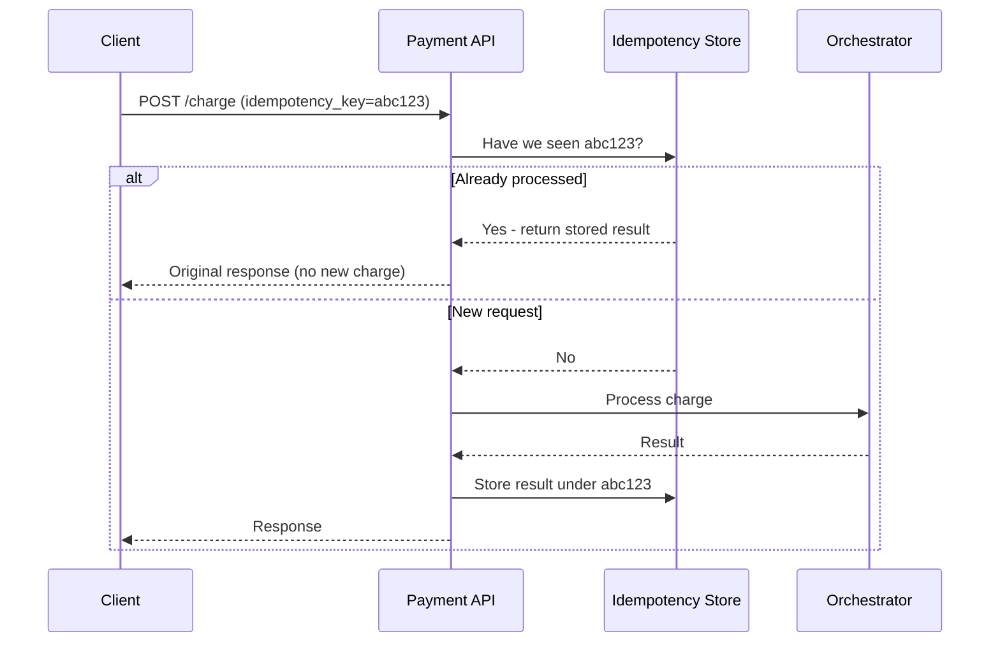
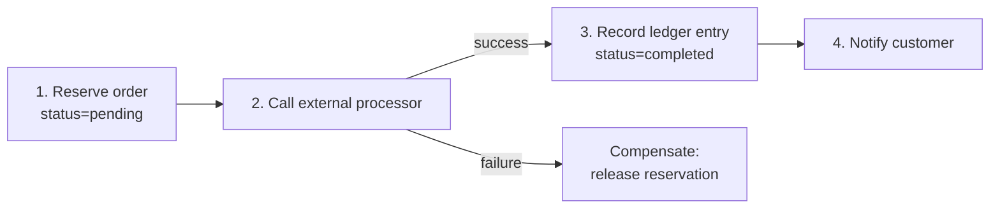
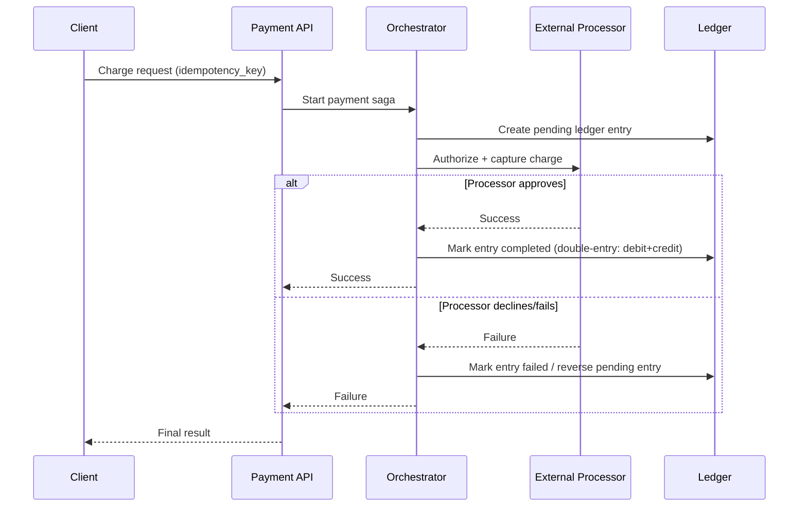

# Design a Payment / Transaction Processing System

A payment system moves money between parties reliably, ensuring no payment is lost, double-charged, or left in an inconsistent state — even when external processors or internal services fail mid-transaction.

In system design interviews, this question tests your understanding of idempotency, distributed transaction patterns (Saga vs. two-phase commit), and strong consistency guarantees for financial data — similar to how Stripe or PayPal operate.

## 1. Problem Statement

Design a system like Stripe's payment processing pipeline that:

- charges a customer's payment method
- records the transaction reliably (an accurate ledger)
- coordinates with external processors (card networks, banks)
- never double-charges, even if a request is retried

## 2. Functional Requirements

- Create a payment/charge request.
- Integrate with an external payment processor (card network/bank).
- Record the outcome in an internal ledger.
- Support refunds and handle partial failures gracefully.

## 3. Non-Functional Requirements

- Strong consistency for money movement — an ambiguous state is unacceptable.
- Idempotent APIs — safe to retry without double-charging.
- High availability, since payments are business-critical.
- Auditable, immutable transaction history.

## 4. High-Level Architecture

## 5. Idempotency

Clients send a unique `idempotency_key` with every charge request (often generated once per user action, e.g., per "Pay Now" click):

- The API checks if that key has already been processed.
- If yes, it returns the **original** result instead of processing the charge again.
- This makes retries (due to network timeouts, client crashes, etc.) safe by design.

## 6. Distributed Transaction: Saga Pattern vs. Two-Phase Commit

Charging a customer usually spans multiple systems (reserve funds, call external processor, update ledger, send receipt) that can't share one database transaction.

| Approach | How it works | Pros | Cons |
|---|---|---|---|
| Two-Phase Commit (2PC) | Coordinator asks all participants to "prepare", then "commit" | Strong atomicity guarantee | Blocking, poor availability, doesn't work well with external processors |
| Saga Pattern | Sequence of local transactions, each with a compensating action on failure | Non-blocking, works across services/external systems | Requires careful compensation logic; eventual consistency |

Real payment systems use the **Saga pattern**, since you cannot force an external bank/card network into a two-phase commit protocol.

If step 2 fails, the compensating action (releasing the reservation) undoes step 1 — no manual cleanup needed and no funds are left in limbo.

## 7. Payment Flow (End-to-End)

## 8. Double-Entry Ledger

Every transaction records two balanced entries (a debit and a credit), so the books always sum to zero and every movement of money is traceable:

- `transaction_id`, `account_id`, `amount`, `direction` (debit/credit), `created_at`.
- The ledger is append-only/immutable — corrections are made via new offsetting entries, never by editing history. This is what makes payment systems auditable.

## 9. Scalability Considerations

- Payment API and orchestrator are stateless and scale horizontally; the idempotency store (e.g., Redis/DB with TTL) is the shared coordination point.
- Ledger writes should be partitioned by `account_id` for scale while keeping per-account operations strongly ordered.
- Reconciliation jobs run asynchronously to detect and flag any mismatch between internal ledger and external processor records.

## 10. Tradeoffs

- Saga pattern sacrifices strict atomicity for availability and cross-system compatibility — compensations add development complexity.
- Synchronous processor calls add latency to the checkout flow; async confirmation (webhooks) improves resilience but complicates client UX.
- Storing every ledger entry immutably increases storage but is essential for auditability and dispute resolution.

## 11. Common Mistakes

- No idempotency key, causing double charges on client retries or network timeouts.
- Treating payment status as a single mutable field instead of an append-only ledger, losing audit history.
- Attempting 2PC across an internal DB and an external bank/processor (not physically possible in practice).
- No reconciliation process to catch drift between internal records and the external processor's records.

## 12. Summary

Payment systems prioritize correctness over raw speed: idempotency keys make retries safe, the Saga pattern coordinates multi-step transactions across independent services without requiring true distributed transactions, and an immutable double-entry ledger guarantees every dollar is accounted for and auditable.
