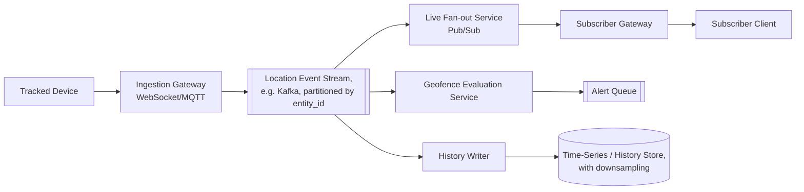
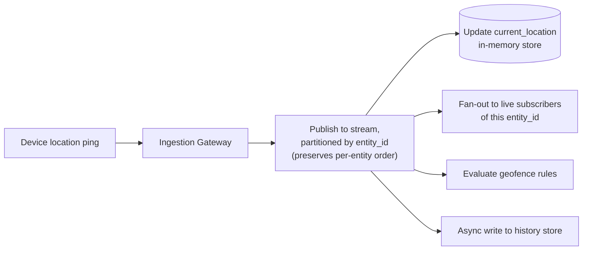
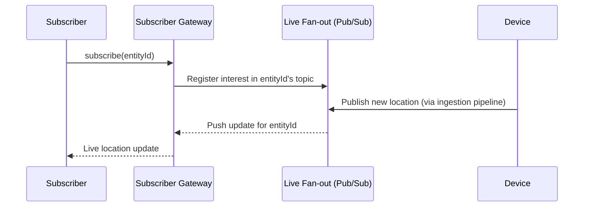
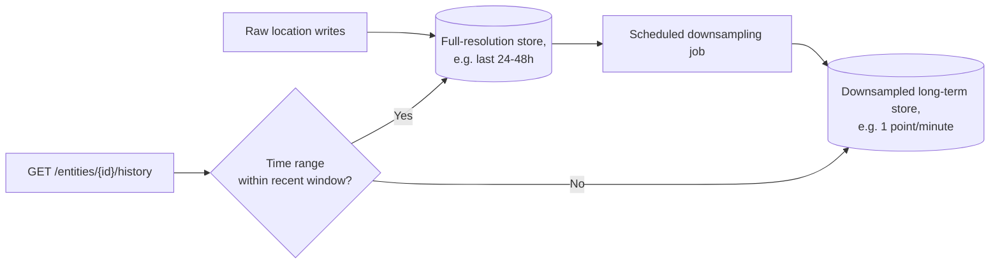

# Design Real-Time Location Tracking

Real-time location tracking systems (ride-sharing driver maps, fleet tracking, "find my friends" style apps) ingest a continuous stream of location pings from many moving devices and fan them out live to whoever is watching, while also persisting a history for replay/analytics.

In system design interviews, this question tests your understanding of high-frequency ingestion pipelines, pub/sub fan-out for live subscribers, and the tradeoffs between freshness, bandwidth, and battery cost.

## 1. Problem Statement

Design a system that supports:

- devices (e.g., delivery vehicles, riders' phones) reporting their location continuously
- subscribers viewing a live-updating map of one or more tracked entities
- historical replay of a device's path over a time range
- geofencing alerts (e.g., "notify when entity enters/exits a zone")

## 2. Requirements

### Functional

- Devices push location updates at regular intervals.
- Subscribers (a dashboard, another user's app) receive live location updates for entities they're watching.
- Query historical path for a given entity and time range.
- Trigger an alert when an entity enters/exits a defined geofence.

### Non-Functional

- Low end-to-end latency from device ping to subscriber update (ideally under a second or two).
- Must scale to millions of concurrently reporting devices without overwhelming the ingestion tier.
- Efficient use of device battery/bandwidth — can't simply ping as fast as possible unconditionally.
- Historical queries must remain fast even as the location-history dataset grows unbounded over time.

## 3. Scale (Rough Estimate)

Assume:

- 5M actively tracked devices, each pinging every 3-5 seconds → roughly 1-1.5M location writes/sec at peak.
- Each tracked entity has, on average, a handful of live subscribers (e.g., a rider watching their driver), though some (public transit tracking) could have many.
- Historical data grows unbounded — at 1M writes/sec even with a compact record, storage is substantial and needs a retention/downsampling policy.

Implications:

- Ingestion must be handled by a horizontally-scalable, low-latency pipeline (e.g., a pub/sub/message-broker layer), not a direct synchronous write to a relational database per ping.
- Live fan-out to subscribers is a pub/sub problem: publish location updates on a per-entity topic/channel that subscribers subscribe to.
- Historical storage should downsample/compact older data (e.g., keep every ping for the last hour, one-per-minute after a day) to keep long-term storage and query costs bounded.

## 4. API Design

### Report Location (Device → Server)

- Over a persistent connection (WebSocket/MQTT) or lightweight `POST /api/v1/devices/{id}/location` — Body: `lat`, `lng`, `timestamp`, `speed?`, `heading?`

### Subscribe to Live Updates (Subscriber → Server)

- WebSocket subscription: `{ type: "subscribe", entityId }`
- Server push: `{ type: "location", entityId, lat, lng, timestamp }`

### Historical Path

- `GET /api/v1/entities/{id}/history?from={ts}&to={ts}`

### Geofence Management

- `POST /api/v1/geofences` — Body: `entityId` or `groupId`, `polygon`/`radius`, `alertOn` (enter/exit)

## 5. High-Level Architecture



## 6. Database Schema

**entities**

- `entity_id` (PK), `type` (vehicle/person/asset), `metadata`

**current_location** (in-memory/fast key-value store, latest known position only)

- `entity_id` (PK), `lat`, `lng`, `heading`, `speed`, `updated_at`

**location_history** (time-series store, partitioned by `entity_id` + time range)

- `entity_id`, `timestamp`, `lat`, `lng`
- Retention policy: full resolution for a short recent window, downsampled (e.g., 1 point/minute) beyond that.

**geofences**

- `geofence_id` (PK), `entity_id` or `group_id`, `shape` (polygon/circle), `alert_on` (enter/exit)

**subscriptions** (in-memory, maps who is watching what)

- `entity_id` → set of `subscriber_connection_id`

## 7. Ingestion & Fan-out Pipeline



Partitioning the event stream by `entity_id` guarantees that updates for a single device are processed in order, while different devices are processed fully in parallel across partitions — this is the key structural decision enabling both ordering correctness and horizontal scale.

## 8. Live Subscription Flow



Using a pub/sub topic per entity (rather than polling) keeps subscriber-facing latency low and avoids wasteful repeated queries for entities that haven't moved.

## 9. Geofence Evaluation

```python
def evaluate_geofences(entity_id, new_lat, new_lng, prev_lat, prev_lng):
    for geofence in get_geofences_for(entity_id):
        was_inside = point_in_shape(prev_lat, prev_lng, geofence.shape)
        is_inside = point_in_shape(new_lat, new_lng, geofence.shape)

        if geofence.alert_on == "enter" and not was_inside and is_inside:
            publish_alert(entity_id, geofence.id, "entered")
        elif geofence.alert_on == "exit" and was_inside and not is_inside:
            publish_alert(entity_id, geofence.id, "exited")
```

Geofence checks compare the previous and new position against each relevant shape, evaluated inline as part of the streaming pipeline so alerts fire within moments of the actual crossing.

## 10. Historical Query & Retention Pipeline



Downsampling older data trades path granularity for bounded long-term storage cost — most historical-replay use cases don't need full per-second resolution for data from weeks ago.

## 11. Key Components

- **Ingestion gateway** — accepts high-frequency location pings, horizontally scaled, publishing into a partitioned event stream.
- **Partitioned event stream** — the backbone of the whole pipeline; partitioning by `entity_id` gives per-entity ordering with full cross-entity parallelism.
- **Live fan-out (pub/sub)** — pushes updates to currently-subscribed clients without polling.
- **Geofence evaluator** — stateful comparison of consecutive positions against registered shapes, run inline in the streaming pipeline.
- **History store with downsampling** — keeps recent data at full resolution and progressively compacts older data to bound storage growth.

## 12. Key Challenges

- **Battery/bandwidth vs. freshness** — fixed high-frequency pinging drains device batteries; adaptive intervals (e.g., ping faster when moving/near a geofence boundary, slower when stationary) balance this.
- **Ordering under network retries** — a delayed/retried ping could arrive out of order; each ping should carry a monotonic sequence number or timestamp so late-arriving stale updates are discarded rather than incorrectly overwriting `current_location`.
- **Fan-out for widely-watched entities** — a public-transit vehicle watched by thousands of riders needs the same "hot entity" fan-out consideration as a celebrity's feed post; pub/sub topics naturally batch this, but very hot topics may need dedicated scaling.
- **Unbounded history growth** — without a retention/downsampling policy, storage costs grow indefinitely; this must be an explicit design decision, not an afterthought.

## 13. Interview Tips

- Emphasize stream partitioning by `entity_id` as the single decision that gives both per-entity ordering and system-wide horizontal scalability — this is the crux insight of the problem.
- Distinguish clearly between the `current_location` fast-path store (for live queries/subscriptions) and the `location_history` store (for replay/analytics) — conflating them into one table is a common weak answer.
- Bring up adaptive ping frequency as a thoughtful answer to "how do you reduce load/battery usage" if the interviewer pushes on efficiency.
- Mention downsampling/retention policy explicitly when asked about long-term storage — it signals awareness that raw high-frequency data can't be kept forever at full resolution.

## 14. Summary

Real-time location tracking is fundamentally a high-throughput, per-entity-ordered streaming pipeline: ingestion publishes into a partitioned event stream, a pub/sub fan-out layer pushes live updates to subscribers, and geofence evaluation runs inline against consecutive positions. A separate, downsampled history store keeps long-term storage bounded while still supporting historical replay queries.
