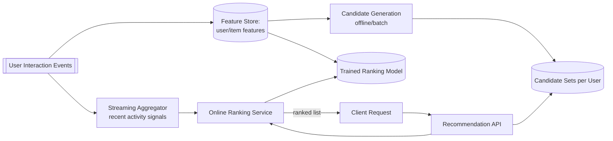
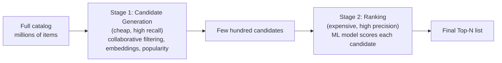
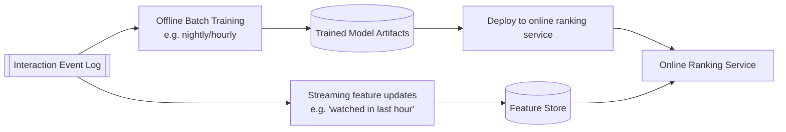
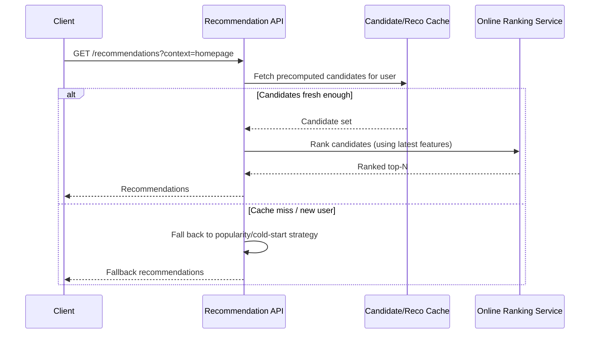

# Design a Recommendation System (Netflix/YouTube)

Recommendation systems predict what content (videos, products, posts) a user is most likely to engage with next, powering homepages and "up next" experiences across platforms like Netflix and YouTube.

In system design interviews, this question tests your understanding of the two-stage candidate-generation-plus-ranking architecture, the offline/online split for ML systems, and handling the cold-start problem.

## 1. Problem Statement

Design a recommendation system that supports:

- generating a personalized ranked list of items (videos/products) for a user
- learning from implicit feedback (views, watch time, clicks) rather than explicit ratings alone
- serving recommendations with low latency on every homepage load
- handling new users/items with little or no interaction history (cold start)

## 2. Requirements

### Functional

- Generate a ranked, personalized list of recommended items per user.
- Continuously incorporate new interaction data (views, likes, watch time) into future recommendations.
- Provide reasonable recommendations even for brand-new users/items.
- Support multiple recommendation "rows"/contexts (homepage, up-next, similar-items).

### Non-Functional

- Homepage load latency must stay low (tens of milliseconds) — cannot run a full ML model over the entire catalog synchronously per request.
- Must scale to catalogs with millions of items and hundreds of millions of users.
- Freshness matters — a user's very recent activity should influence near-term recommendations, not just yesterday's batch.
- Support experimentation (A/B testing different ranking models safely).

## 3. Scale (Rough Estimate)

Assume:

- 200M users, 10M items (videos), billions of interaction events/day (views, likes, watch-time signals).
- Homepage requests: hundreds of thousands of QPS at peak, each needing a personalized ranked list from a catalog far too large to score exhaustively per request.

Implications:

- Scoring every item in the catalog against every user at request time is computationally infeasible — recommendations must be narrowed to a small candidate set before any expensive ranking model runs.
- Model training happens offline/in batch (or near-real-time streaming) over the full interaction history; only lightweight inference happens in the request path.
- Precomputing/caching top recommendations per user (refreshed periodically) is usually necessary to meet latency targets.

## 4. API Design

### Get Recommendations

- `GET /api/v1/users/{id}/recommendations?context=homepage&limit=20`
- Response: ordered list of `itemId`, `score`, optionally `reason` (e.g., "Because you watched X")

### Record Interaction (feedback loop)

- `POST /api/v1/events` — Body: `userId`, `itemId`, `eventType` (view/like/click/watch_duration)

### Similar Items

- `GET /api/v1/items/{id}/similar`

## 5. High-Level Architecture

## 6. Database Schema

**user_features** (feature store, refreshed periodically + streaming updates)

- `user_id` (PK), `embedding` (learned vector), `recent_categories`, `avg_watch_time`

**item_features**

- `item_id` (PK), `embedding`, `category`, `popularity_score`, `created_at`

**interaction_events** (append-only log, source of truth for training)

- `user_id`, `item_id`, `event_type`, `watch_duration`, `timestamp`

**candidate_sets** (precomputed per user, refreshed on a schedule)

- `user_id`, `candidate_item_ids` (a few hundred, narrowed from millions)

**recommendations_cache**

- `user_id`, `context` (homepage/up_next), `ranked_item_ids`, `generated_at`

## 7. Two-Stage Architecture: Candidate Generation + Ranking

Scoring millions of items per user request is infeasible, so recommendation systems split the problem into two stages with very different cost profiles.

- **Stage 1 (candidate generation)**: cheaply narrows millions of items down to a few hundred plausible candidates per user, using techniques like collaborative filtering ("users similar to you liked...") or nearest-neighbor search over learned embeddings. Optimized for recall (don't miss good candidates).
- **Stage 2 (ranking)**: runs a more expensive, precise model only on this small candidate set to produce the final ordered list. Optimized for precision (get the order right).

This split is what makes personalized recommendation computationally feasible at request time.

## 8. Candidate Generation Approaches

| Approach | Idea | Good for |
|---|---|---|
| Collaborative filtering | "Users who interacted like you did also liked X" | Leverages behavior patterns across users |
| Content-based filtering | Match item features/embeddings to a user's historical preferences | Works even with sparse cross-user data |
| Embedding nearest-neighbor | Represent users/items as vectors; find items whose embedding is close to the user's | Scales well with approximate nearest-neighbor search (e.g., HNSW/FAISS) |
| Popularity/trending | Globally or regionally popular items | Cold-start fallback |

Real systems typically blend several candidate sources together before ranking, rather than relying on just one.

## 9. Offline Training / Online Serving Pipeline

Model **training** (expensive, computed over the full historical dataset) happens offline on a schedule, while **inference** (scoring a small candidate set for one user) happens online with low latency, reading precomputed features rather than recomputing them from raw logs per request.

## 10. Flow: Serving a Recommendation Request

## 11. Cold-Start Handling

- **New users**: no interaction history to personalize from — fall back to popularity/trending items, or ask onboarding questions (preferred genres/categories) to seed an initial profile.
- **New items**: no engagement signal yet — rely on content-based features (category, metadata, embeddings from title/description) until enough interaction data accumulates to support collaborative signals.
- Both cases blend into the same candidate-generation stage as just another source, rather than requiring a wholly separate code path.

## 12. Key Components

- **Feature store** — serves both offline training and low-latency online inference from the same underlying user/item features, refreshed on different cadences (batch + streaming).
- **Candidate generation service** — narrows the full catalog down using collaborative filtering, embeddings, and popularity signals; optimized for recall.
- **Online ranking service** — scores the small candidate set with a more precise model at request time; optimized for precision and low latency.
- **Precomputed recommendation cache** — absorbs the bulk of homepage load without recomputation per request.
- **Streaming feature aggregator** — folds very recent activity into the feature store so recommendations don't feel stale even between batch training runs.

## 13. Key Challenges

- **Cold start** — both new users and new items lack the interaction signal the core algorithms depend on; requires explicit fallback strategies rather than assuming the main pipeline "just works" for them.
- **Feedback loops / filter bubbles** — always recommending what's already popular/clicked can over-narrow variety; systems often inject controlled exploration (showing some diverse/less-certain items) to keep learning and avoid staleness.
- **Freshness vs. cost** — fully retraining models per request is infeasible; balancing batch retraining cadence against streaming feature updates is a core tuning problem.
- **A/B testing infrastructure** — safely rolling out a new ranking model to a fraction of traffic and measuring impact (engagement, watch time) requires dedicated experimentation infrastructure layered on top of the serving path.

## 14. Interview Tips

- Lead with the two-stage candidate-generation-then-ranking architecture — this is the single most important structural insight interviewers expect for this question.
- Explicitly separate offline training (full historical data, expensive, scheduled) from online inference (small candidate set, cheap, low-latency) — conflating them is a common weak answer.
- Bring up cold start proactively; it's one of the most commonly asked follow-ups.
- Mention precomputing/caching recommendations per user as the practical answer to "how do you keep homepage latency low" — real-time full personalization on every request usually isn't necessary or feasible.

## 15. Summary

Recommendation systems solve an otherwise-infeasible request-time problem (scoring millions of items per user) by splitting work into cheap, high-recall candidate generation followed by expensive, high-precision ranking over a small candidate set. Model training happens offline over the full interaction history, while serving reads precomputed features and cached candidates to stay fast — with explicit cold-start fallbacks for users and items lacking interaction history.
