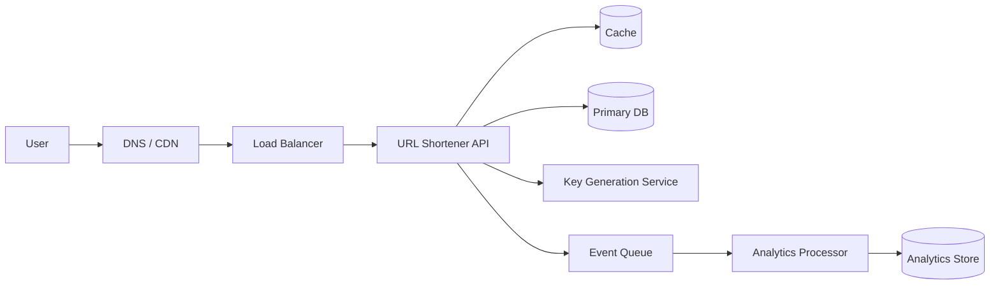
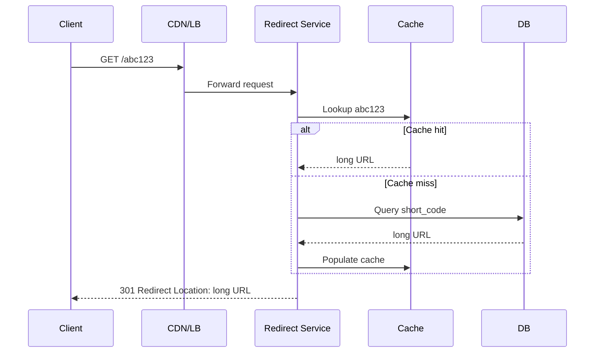

# Design URL Shortner

A URL shortener converts long URLs into compact aliases and redirects users from the short link to the original destination.

In system design interviews, this question tests your ability to design for high read traffic, low-latency redirects, large keyspace management, and operational reliability.

## 1. Problem Statement

Build a service like bit.ly or tinyurl that supports:

- create short URL from long URL
- redirect short URL to long URL
- optional custom aliases
- analytics (optional in medium scope)
- high availability and low latency

## 2. Functional Requirements

- Users can submit a long URL and receive a short code.
- Visiting the short URL should redirect quickly to long URL.
- Links may have expiration (optional requirement).
- Custom alias support (optional but common).
- Duplicate long URLs can map to same or different short codes, depending on policy.

## 3. Non-Functional Requirements

- Very low redirect latency (typically under 100 ms at edge).
- High read/write ratio (redirects far exceed creates).
- High availability for redirect path.
- Durable mapping storage.
- Protection against abuse/malicious links.

## 4. High-Level Architecture

Core path:

- write path: create short URL
- read path: redirect short URL

## 5. API Design

### Create Short URL

- Method: POST
- Path: /api/v1/shorten

Request:

- longUrl
- optional customAlias
- optional expiration

Response:

- shortCode
- shortUrl
- expiration

### Redirect

- Method: GET
- Path: /{shortCode}

Response:

- HTTP 301 or 302 redirect to long URL

### Optional Analytics

- Method: GET
- Path: /api/v1/links/{shortCode}/stats

## 6. Data Model

Main mapping table:

- short_code (PK)
- long_url
- created_at
- expires_at (nullable)
- user_id (nullable)
- is_active

Indexes:

- primary index on short_code
- optional index on user_id for management views

Analytics table or event pipeline:

- short_code
- timestamp
- country/device/referrer

Analytics is typically asynchronous to keep redirect path fast.

## 7. Short Code Generation Strategies

### Option A: Auto-Increment ID + Base62

1. Generate numeric ID.
2. Encode ID into Base62 (a-zA-Z0-9).

Pros:

- simple and deterministic
- compact output

Cons:

- predictable sequences
- potential hot spots depending on storage engine

### Option B: Random String

Generate random 6-8 character codes.

Pros:

- less predictable

Cons:

- collision checks required
- may need retries

### Option C: Dedicated Key Generation Service (KGS)

Pre-generates unique keys and hands them out.

Pros:

- decouples key allocation from main write path

Cons:

- additional moving part

For medium design, Auto-Increment + Base62 is acceptable with notes on predictability.

## 8. Redirect Flow

This path must be optimized for high QPS.

## 9. Caching Strategy

Cache key:

- short_code -> long_url

Benefits:

- avoids frequent DB reads
- significantly lowers redirect latency

Policies:

- TTL with refresh on hit or fixed expiry
- negative caching for invalid short codes to protect DB

## 10. 301 vs 302 Redirect

- 301 (permanent): browsers and crawlers may cache aggressively
- 302 (temporary): better when destination might change

Decision depends on product behavior.

## 11. Scalability Considerations

### Read-heavy optimization

- CDN edge caching for extremely hot links
- distributed cache layer
- stateless redirect servers behind load balancer

### Write scaling

- partition mapping table by short_code hash
- replicate database for read resilience
- async processing for analytics and abuse checks

## 12. Partitioning/Sharding

When mappings grow very large:

- shard by short_code hash
- router determines shard location

Important:

- keep lookup O(1) from router perspective
- avoid cross-shard joins in redirect path

## 13. Availability and Fault Tolerance

- multiple API instances across zones
- database replication and failover
- cache cluster with redundancy
- graceful fallback when analytics pipeline fails

Redirect service should remain available even if analytics components are down.

## 14. Security and Abuse Controls

URL shorteners are abuse targets. Add:

- rate limiting on create API
- malware/phishing URL checks
- domain allow/block lists
- auth for management APIs
- bot detection for suspicious traffic

Never blindly redirect unsafe destinations in enterprise environments.

## 15. Consistency and Updates

If long URL can be edited:

- invalidate cache after update
- handle propagation delay
- choose whether old redirects are allowed

If immutable links are used, system becomes simpler and more cache-friendly.

## 16. Capacity Estimation (Interview Style)

Example assumptions:

- 100M new URLs/month
- 100:1 read-to-write ratio

Implications:

- redirect tier must handle very high QPS
- storage must scale to billions of rows
- cache hit rate drives DB cost dramatically

You do not need exact numbers, but show estimation thinking.

## 17. Tradeoffs

- predictable IDs are simpler but easier to enumerate
- longer random codes reduce collisions but hurt UX
- strong validation improves safety but increases write latency
- aggressive caching improves speed but complicates invalidation

Good design states these tradeoffs explicitly.

## 18. Common Mistakes

- storing analytics in redirect critical path
- no cache and overwhelming DB on reads
- weak collision handling for random keys
- no abuse prevention controls
- underestimating cache invalidation and failover behavior

## 19. Medium-Level Interview Answer Structure

1. define APIs and core entities
2. describe key generation strategy
3. explain write and redirect flows
4. add cache and DB scaling plan
5. cover availability and failure scenarios
6. discuss security/abuse protections
7. summarize tradeoffs and future enhancements

## 20. Summary

A URL shortener is a read-heavy distributed system where fast key-to-URL lookup is the central challenge. A strong medium-level design uses deterministic key generation, cache-first redirect path, durable mapping storage, and asynchronous analytics, while addressing abuse prevention and operational resilience.
