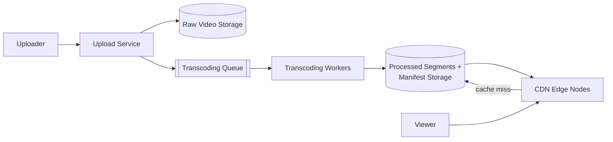
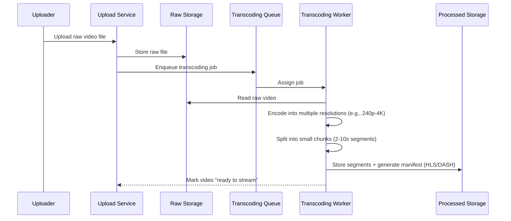
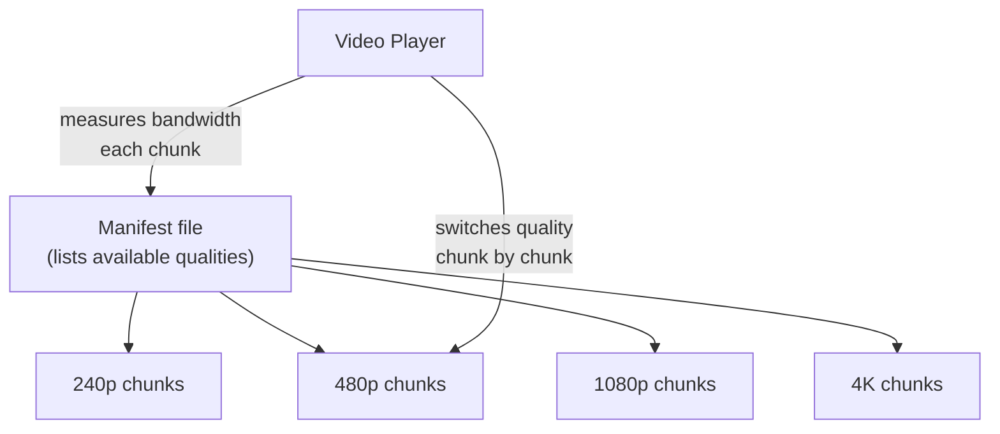
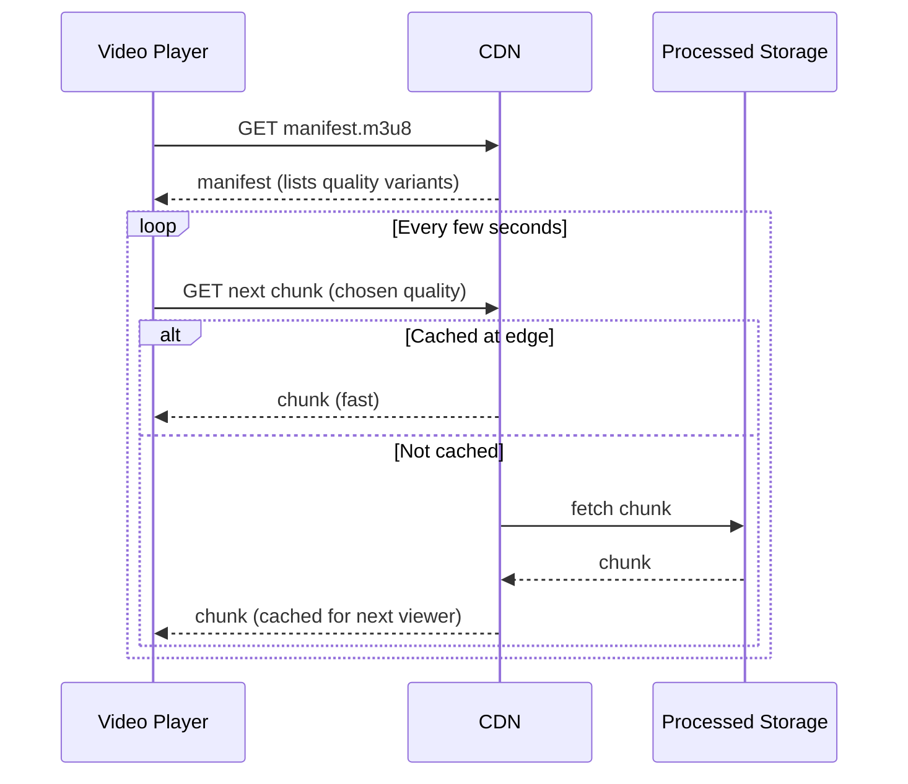

# Design a Video Streaming Platform

A video streaming platform lets users upload video content and stream it back smoothly across varying network conditions and devices.

In system design interviews, this question tests your understanding of media processing pipelines, adaptive streaming, and CDN-driven delivery at global scale — similar to how YouTube or Netflix operate.

## 1. Problem Statement

Design a system like YouTube that supports:

- uploading videos of various formats/resolutions
- processing them into streamable formats
- playing videos smoothly on phones, laptops, and TVs on any network speed

## 2. Functional Requirements

- Upload a video file.
- Transcode into multiple resolutions/bitrates.
- Stream video with minimal buffering.
- Support seeking to any point in the video.

## 3. Non-Functional Requirements

- Playback must start quickly (low startup latency).
- Must adapt to changing network conditions mid-playback.
- Massive read scale (millions of concurrent viewers) vs. much smaller write (upload) volume.
- Global low-latency delivery.

## 4. High-Level Architecture

## 5. Upload & Transcoding Flow

Transcoding is asynchronous and CPU-intensive, so it runs on a separate worker pool that scales independently from the upload/playback path.

## 6. Adaptive Bitrate Streaming (ABR)

Instead of one fixed-quality file, the video is encoded into multiple bitrate/resolution variants, split into small chunks, and described by a manifest file (HLS `.m3u8` or DASH `.mpd`):

The player continuously measures available bandwidth and switches between quality variants chunk-by-chunk, so playback keeps going smoothly instead of buffering when the network slows down.

## 7. Playback Flow

## 8. Data Model

- **Video metadata**: `video_id`, `owner_id`, `title`, `status` (uploading/processing/ready), `duration`.
- **Manifest**: list of available renditions and chunk URLs per video.
- **Storage**: raw uploads in cheap object storage; processed chunks in storage fronted by a CDN.

## 9. Scalability Considerations

- CDN edge caching absorbs the vast majority of playback traffic — origin storage only serves cache misses.
- Transcoding workers scale horizontally and process jobs from a queue independently of upload traffic spikes.
- Popular videos benefit enormously from edge caching; long-tail videos rely more on origin fetches.

## 10. Tradeoffs

- More resolution variants improve playback quality across devices but increase storage and transcoding cost.
- Smaller chunk sizes allow faster quality switching but add per-chunk request overhead.
- Storing all raw uploads forever is costly — many platforms delete/archive raw files after successful transcoding.

## 11. Common Mistakes

- Serving one fixed quality file to everyone regardless of network conditions.
- Doing transcoding synchronously in the upload request path (blocks the uploader for a long time).
- Not using a CDN, causing the origin to be overwhelmed by popular video traffic.
- Ignoring seek support — chunked storage plus manifests is what makes fast seeking possible.

## 12. Summary

A video streaming platform separates the expensive, asynchronous transcoding pipeline from the read-heavy playback path. Adaptive bitrate streaming, chunked storage, and CDN edge caching together let it serve smooth video to millions of viewers with varying network conditions and devices.
