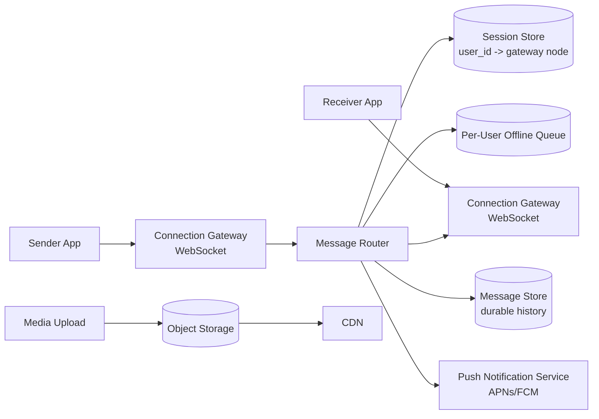
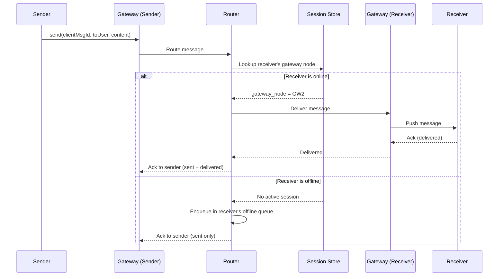
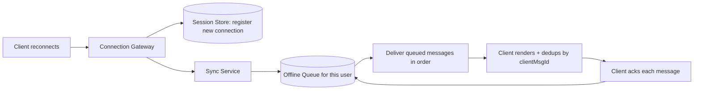

# Design WhatsApp (Messaging)

WhatsApp delivers billions of 1:1 and group messages daily, with strong delivery guarantees (messages shouldn't be lost or duplicated visibly), low latency, and support for users who are frequently offline.

In system design interviews, this question tests your understanding of message delivery semantics, per-user message queues, presence, and multi-device synchronization.

## 1. Problem Statement

Design a system like WhatsApp that supports:

- sending 1:1 and group text messages
- reliable delivery even when the recipient is offline
- delivery/read receipts and online presence
- syncing message history across multiple devices

## 2. Requirements

### Functional

- Send/receive messages in 1:1 and group chats.
- Messages sent while the recipient is offline must be delivered once they reconnect.
- Delivery receipts (sent/delivered/read) and online/last-seen presence.
- Support the same account being used on multiple devices with synced history.

### Non-Functional

- Low end-to-end latency for online users (sub-second).
- At-least-once delivery with client-side deduplication (never silently drop a message).
- Massive persistent-connection scale (billions of concurrently online users).
- Optional end-to-end encryption (message content unreadable to the server).

## 3. Scale (Rough Estimate)

Assume:

- 2B users, ~500M concurrently connected at peak (each holding a persistent connection).
- 100B messages/day → ~1.2M messages/sec average, higher at peak (e.g., New Year's Eve spikes).
- Average message is small (~100 bytes text), but media messages (photos/videos) dominate storage/bandwidth.

Implications:

- The connection layer (holding hundreds of millions of concurrent sockets) must be horizontally sharded across many gateway servers.
- Messages for offline users must be durably queued — an in-memory-only approach would lose data on gateway restarts.
- Media should never flow through the messaging hot path directly — upload to object storage and send a reference/link instead.

## 4. API Design

Most traffic runs over a persistent connection (WebSocket/custom TCP), not plain REST, but the logical operations are:

### Send Message

- Client → Server (over persistent connection): `{ type: "send", toUserId/groupId, clientMsgId, content, timestamp }`
- Server → Client (ack): `{ type: "ack", clientMsgId, serverMsgId }`

### Receive Message (push)

- Server → Client: `{ type: "message", serverMsgId, fromUserId, content, timestamp }`

### Fetch Missed Messages (on reconnect)

- `GET /api/v1/messages/sync?since=lastSyncCursor`

### Receipts / Presence

- `POST /api/v1/messages/{id}/receipt` (`delivered` / `read`)
- `POST /api/v1/presence` (`online` / `last_seen`)

## 5. High-Level Architecture

## 6. Database Schema

**users**

- `user_id` (PK), `phone_number`, `devices` (list of `device_id`, `public_key` for E2E encryption)

**messages** (durable history, often a wide-column/append-only store partitioned by conversation)

- `message_id` (PK), `conversation_id`, `sender_id`, `content` (encrypted blob or reference), `timestamp`, `status` (sent/delivered/read)

**conversations**

- `conversation_id` (PK), `type` (1:1 / group), `participant_ids`

**offline_queue** (per-user, e.g. a durable log/queue keyed by `user_id`)

- `user_id`, `message_id`, `enqueued_at` — drained once the user reconnects and acknowledges.

**session_store** (in-memory, e.g. Redis)

- `user_id` → `gateway_node_id` (which server currently holds this user's live connection)

## 7. Message Delivery Semantics

- **At-least-once delivery**: the server keeps a message queued until the client explicitly acknowledges receipt. If the ack is lost, the message may be delivered twice.
- **Client-side deduplication**: every message carries a client-generated `clientMsgId`; the receiving client drops duplicates it has already rendered, making at-least-once delivery safe from the user's perspective (effectively exactly-once as observed by the user).
- **Ordering**: messages within a single conversation are ordered by a per-conversation monotonic sequence number, not by wall-clock time (clocks can skew across devices).

## 8. Flow: Sending a Message (Online Recipient)

## 9. Offline Delivery & Multi-Device Sync Pipeline

For multi-device accounts, each device maintains its own sync cursor against the durable message store, so a message is fanned out to every registered device, not just the "primary" one.

## 10. Key Components

- **Connection gateway** — holds the persistent connection per online user; horizontally sharded, with a session store mapping `user_id → gateway node` so any part of the system can route to the right place.
- **Message router** — decides whether to deliver live or enqueue for offline delivery, and coordinates acks.
- **Durable message store** — the source of truth for conversation history, independent of whether any recipient is currently online.
- **Push notification service** — wakes up a mobile client via APNs/FCM when it has no active connection, so the OS can show a notification.
- **Presence service** — tracks online/last-seen state, updated on connect/disconnect and periodic heartbeats.

## 11. Key Challenges

- **Massive persistent-connection scale** — hundreds of millions of concurrent sockets require careful connection-gateway sharding and lightweight per-connection state.
- **Exactly-once user experience over at-least-once delivery** — solved via client-generated message IDs and idempotent rendering, not by trying to guarantee true exactly-once at the transport level (which is prohibitively expensive).
- **Multi-device consistency** — every device must converge to the same conversation history; this is usually solved with per-device sync cursors against an immutable message log rather than mutating shared state.
- **Group messages at scale** — a message to a 500-person group means fanning out to up to 500 recipients' queues; this looks similar to the "celebrity fan-out" problem seen in feed systems.

## 12. Interview Tips

- Explicitly state the delivery guarantee (at-least-once + client dedup) — this is the detail interviewers listen for most closely.
- Separate the "hot path" (live delivery via gateway) from the "cold path" (offline queue + push notification) early in your design.
- Mention that message ordering uses a per-conversation sequence number, not timestamps, to avoid clock-skew bugs.
- If asked about encryption, it's enough to say content is end-to-end encrypted so the server only routes opaque blobs — deep cryptographic protocol detail is rarely required unless explicitly asked.

## 13. Summary

WhatsApp's architecture centers on a sharded connection-gateway layer with a session store to route messages to wherever a user is currently connected, backed by a durable per-user offline queue for reliable delivery when they're not. At-least-once delivery combined with client-side message ID deduplication gives users an effectively exactly-once experience, while multi-device sync is handled by giving each device its own cursor over an immutable message log.
