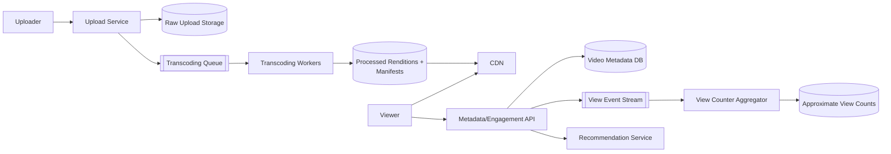
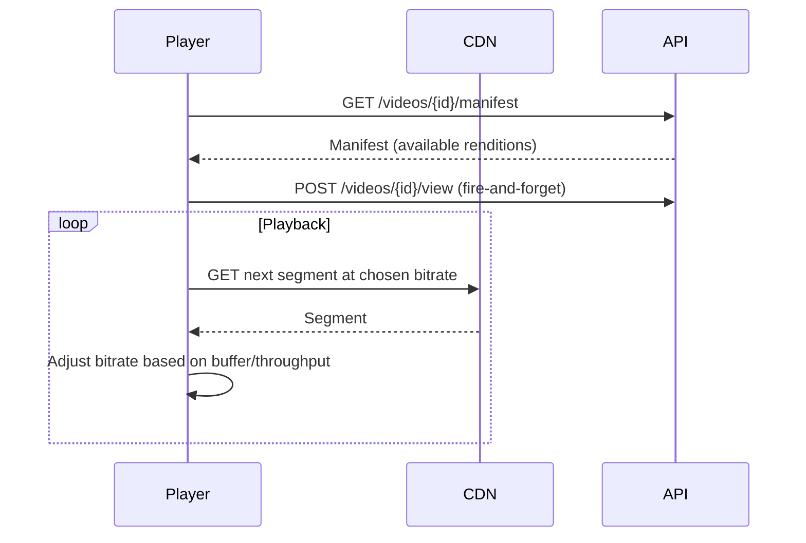
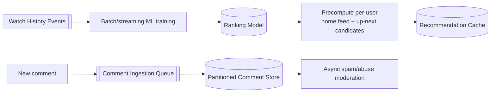

# Design YouTube (Video Streaming)

YouTube handles massive, unpredictable volumes of user-generated video uploads (unlike a curated catalog such as Netflix), transcodes them into streamable formats, and serves them at enormous scale alongside comments, recommendations, and live streaming.

In system design interviews, this question tests your understanding of upload pipelines at user-generated scale, view-count/engagement systems under heavy write contention, and how recommendations and comments layer onto a video platform.

## 1. Problem Statement

Design a system like YouTube that supports:

- users uploading videos of arbitrary length/quality
- transcoding into multiple streamable resolutions
- watching videos with adaptive playback and accurate view counts
- comments and a personalized recommendation feed

## 2. Requirements

### Functional

- Upload a video; it becomes streamable after processing.
- Stream with adaptive bitrate; support seeking.
- Track view counts, likes, and comments per video.
- Show a personalized recommendation feed ("Up Next" / homepage).

### Non-Functional

- Enormous, unpredictable upload volume (anyone can upload, unlike a curated catalog).
- Playback read traffic vastly exceeds upload/write traffic.
- View-count and comment writes can be extremely hot on a single viral video (contention on one row).
- Global low-latency delivery via CDN.

## 3. Scale (Rough Estimate)

Assume:

- 500 hours of video uploaded per minute across all users.
- 5B+ video views/day, extremely skewed (a small fraction of videos get the vast majority of views — a long-tail distribution).
- Comments on a viral video can arrive at thousands per second during a trending spike.

Implications:

- Upload/transcoding pipeline must scale horizontally and handle huge variance in file size/length/format from untrusted user input (unlike Netflix's curated studio content).
- View counters need approximate/batched counting rather than a single row incremented synchronously per view, or the hottest videos will bottleneck on write contention.
- CDN caching is even more important than for Netflix, given the unpredictable, long-tail popularity distribution (can't pre-warm caches as confidently for unknown user uploads).

## 4. API Design

### Upload

- `POST /api/v1/videos` — creates video metadata, returns an upload session (chunked/resumable, similar to large file upload patterns).
- `POST /api/v1/videos/{id}/complete` — finalizes upload, triggers transcoding.

### Playback

- `GET /api/v1/videos/{id}/manifest` — HLS/DASH manifest with available renditions.

### Engagement

- `POST /api/v1/videos/{id}/view` — records a view (batched/approximate counting under the hood).
- `POST /api/v1/videos/{id}/comments`
- `POST /api/v1/videos/{id}/like`

### Recommendations

- `GET /api/v1/feed/home`
- `GET /api/v1/videos/{id}/up-next`

## 5. High-Level Architecture



## 6. Database Schema

**videos**

- `video_id` (PK), `owner_id`, `title`, `description`, `status` (processing/ready/failed), `created_at`

**renditions**

- `video_id`, `resolution`, `bitrate`, `manifest_url`

**view_counts** (eventually consistent, updated via aggregation, not per-request writes)

- `video_id`, `approx_view_count`, `last_updated`

**comments** (often a wide-column/append-only store partitioned by `video_id` for scale)

- `comment_id` (PK), `video_id`, `user_id`, `text`, `created_at`

**watch_history**

- `user_id`, `video_id`, `watched_at`, `watch_duration` — feeds recommendations.

## 7. Upload & Transcoding Pipeline


This mirrors the general video-transcoding pattern (see Design Netflix), with the key difference that input here is untrusted, highly variable user-generated content, so an extra validation/moderation step is needed before/alongside transcoding.

## 8. View Counting Under Heavy Contention (Code)

Incrementing a single `view_count` row synchronously on every playback request creates a severe hotspot for viral videos. Instead, batch view events and aggregate asynchronously:

```python
def record_view(video_id, viewer_id):
    # Fire-and-forget: publish an event instead of writing directly to the counter row
    event_stream.publish("view_events", {"video_id": video_id, "viewer_id": viewer_id, "ts": now()})

# Separate aggregator process, consuming in small batches every few seconds
def aggregate_view_counts(events_batch):
    counts_by_video = defaultdict(int)
    for event in events_batch:
        counts_by_video[event["video_id"]] += 1

    for video_id, count in counts_by_video.items():
        # One batched increment per video per aggregation window, not one write per view
        db.execute(
            "UPDATE view_counts SET approx_view_count = approx_view_count + %s WHERE video_id = %s",
            (count, video_id),
        )
```

This makes the displayed count an eventually-consistent approximation (matching YouTube's real-world behavior of view counts "settling" rather than updating instantly), in exchange for removing the single-row write bottleneck.

## 9. Playback Flow (Adaptive Bitrate)



Playback itself is identical in shape to Netflix's ABR streaming (see Design Netflix) — the distinguishing complexity in YouTube is upstream (ingestion at user-generated scale) and downstream (comments/recommendations), not the playback protocol itself.

## 10. Recommendation & Comments Pipeline



Comments are partitioned by `video_id` so a single viral video's comment volume doesn't bottleneck the whole comment store, and moderation runs asynchronously so posting a comment stays fast even if spam detection is relatively slow.

## 11. Key Components

- **Upload/transcoding pipeline** — handles highly variable, untrusted user-generated input at massive scale, distinct from a curated-content pipeline.
- **CDN** — serves the actual video bytes; essential given the long-tail, hard-to-predict popularity distribution of user uploads.
- **View counter aggregator** — converts per-view writes into a batched, eventually-consistent counter to avoid hot-row contention on viral videos.
- **Partitioned comment store** — isolates a single video's comment surge from affecting others.
- **Recommendation service** — precomputed/cached per user, feeding both the homepage and "up next" experiences.

## 12. Key Challenges

- **Viral hot-row contention** — solved by batching view/like/comment-count updates asynchronously instead of incrementing synchronously per event.
- **Untrusted, highly variable uploads** — unlike a studio pipeline, uploads need validation, abuse/copyright scanning, and must gracefully handle malformed/huge files without crashing workers.
- **Long-tail content popularity** — CDN pre-warming strategies that work for a known catalog (Netflix) don't directly apply; caching must adapt reactively as videos go viral unpredictably.
- **Comment moderation at scale** — spam/abuse detection must run without blocking comment submission, and must scale independently per video.

## 13. Interview Tips

- Explicitly contrast this with Netflix: user-generated, unpredictable-volume uploads (validation/abuse-scanning needed) vs. Netflix's curated studio pipeline — interviewers like seeing this distinction drawn out.
- Bring up the hot-row view-count problem and its batched-aggregation fix — it's one of the most commonly probed details in this question.
- Reuse the ABR playback explanation from video-streaming fundamentals rather than re-deriving it — focus your time on the parts unique to YouTube (ingestion, counters, comments, recommendations).
- Mention comment store partitioning by `video_id` if asked about comments at scale — a single hot video shouldn't degrade the whole comment system.

## 14. Summary

YouTube's architecture reuses the general transcoding/ABR playback pattern from video streaming, but its distinguishing challenges are upstream and downstream of playback: an upload pipeline built for untrusted, highly variable user-generated content, and hot-row mitigation via batched, eventually-consistent counters for views/likes/comments on viral videos. Partitioned comment storage and precomputed recommendations round out a system where popularity is far less predictable than a curated catalog.
