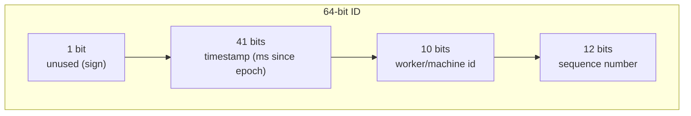
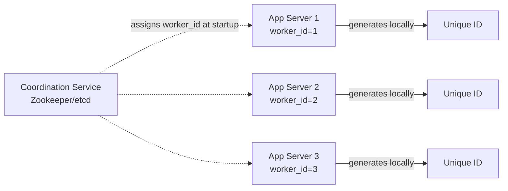
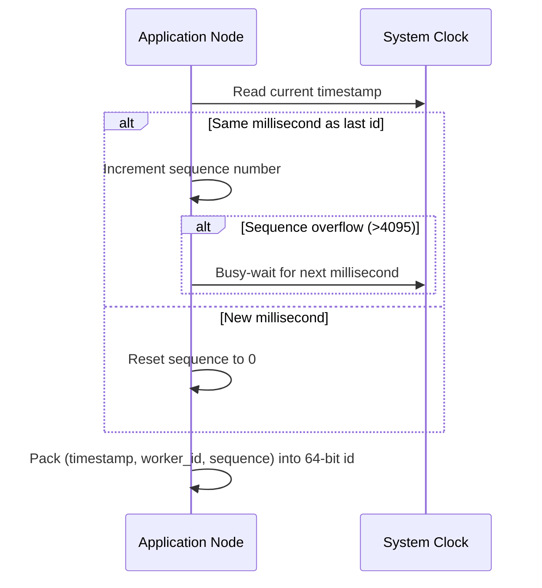

# Distributed Unique ID Generator

A distributed ID generator produces unique identifiers across many machines without a central bottleneck, while ideally keeping ids roughly sortable by creation time.

In system design interviews, this question tests your understanding of coordination-free uniqueness, clock handling, and the tradeoffs between different id schemes — the classic reference implementation is Twitter's Snowflake.

## 1. Problem Statement

Design a service that generates unique 64-bit ids across many application servers such that:

- ids never collide, even when generated concurrently on different machines
- ids are roughly increasing over time (useful for sorting, pagination, and database indexing)
- generation does not require a round trip to a central coordinator on the hot path

## 2. Functional Requirements

- Generate a unique id on demand with very low latency (local, in-process generation).
- Ids should be sortable by creation time (at least approximately).
- Support many generator nodes/workers running independently.

## 3. Non-Functional Requirements

- Extremely high throughput (thousands of ids/sec per node).
- No single point of failure or central bottleneck.
- Tolerant of clock issues (drift, restarts).

## 4. Approaches Compared

| Approach | How it works | Pros | Cons |
|---|---|---|---|
| UUID (v4) | 128-bit random value | Zero coordination, globally unique | Not sortable, large (16 bytes), poor DB index locality |
| DB auto-increment | Single DB sequence | Simple, strictly ordered | Central bottleneck, hard to scale writes |
| Auto-increment with ranges | Each node reserves a block of ids from DB (e.g., 1000 at a time) | Reduces DB calls | Still has a central authority; gaps on crash |
| Snowflake (bit-packed) | Timestamp + worker id + sequence packed into 64 bits | No coordination after startup, sortable, compact | Requires unique worker ids and clock discipline |

Snowflake-style generation is the standard interview answer because it eliminates the central bottleneck entirely.

## 5. Snowflake-Style ID Layout

A 64-bit id is split into fixed-width fields:

- **Timestamp (41 bits)**: milliseconds since a custom epoch — gives ~69 years of range and makes ids roughly time-sortable.
- **Worker id (10 bits)**: up to 1024 unique generator nodes, usually assigned via config or a coordination service (Zookeeper/etcd) at startup.
- **Sequence (12 bits)**: up to 4096 ids per millisecond per worker, incrementing for ids generated within the same millisecond.

## 6. High-Level Architecture

Each application node only talks to the coordination service once, at startup, to claim a unique worker id — after that, id generation is entirely local and coordination-free.

## 7. ID Generation Flow

## 8. Handling Clock Drift

- If the system clock moves **backward** (e.g., NTP correction), the generator must detect `current_ts < last_ts` and either wait until the clock catches up or raise an alarm — never generate a duplicate/out-of-order id silently.
- Using a monotonic clock source where possible reduces the chance of backward jumps.

## 9. Scalability Considerations

- Generation is fully horizontal — adding more app nodes just means assigning more worker ids, with no shared state on the hot path.
- The only shared dependency (the coordination service) is used rarely (at startup/restart), so it never becomes a throughput bottleneck.

## 10. Tradeoffs

- Snowflake ids are compact and sortable but expose approximate creation time and node count (minor information leak).
- UUIDs avoid coordination entirely but hurt database index performance due to randomness (no locality).
- Range-based allocation is simpler to build but reintroduces a shared bottleneck under very high scale.

## 11. Common Mistakes

- Using random UUIDs as primary keys in a high-write relational table and being surprised by index fragmentation.
- Not handling clock rollback, leading to duplicate or out-of-order ids.
- Hardcoding worker ids instead of assigning them dynamically, causing collisions when nodes are added/replaced.

## 12. Summary

Distributed id generation solves uniqueness at scale by encoding time, machine identity, and a local sequence number into a single compact id — avoiding any central coordination on the critical path. The Snowflake approach is the industry-standard pattern, trading a small amount of information exposure for massive scalability and sortable ids.
