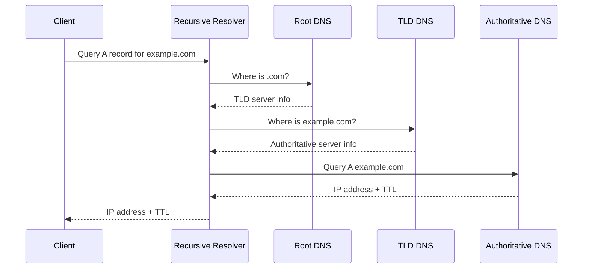

# DNS

DNS (Domain Name System) is the internet's naming service. It translates human-readable domain names like example.com into IP addresses that computers use for network communication.

In system design, DNS is critical because it impacts latency, availability, failover behavior, and global traffic routing.

## Why DNS Exists

Humans remember names. Networks route with IP addresses.

DNS provides that mapping layer so applications can use friendly names while infrastructure can move behind changing IPs.

## Core Components

### 1. Stub Resolver

Client-side resolver in OS or browser that initiates DNS lookup.

### 2. Recursive Resolver

Usually provided by ISP, enterprise DNS, or public resolver. It performs lookups on behalf of clients and caches results.

### 3. Root Name Servers

Top-level starting point that directs queries to TLD servers.

### 4. TLD Name Servers

Responsible for top-level domains like .com, .org, .net.

### 5. Authoritative Name Servers

Final source of truth for a domain's DNS records.

## Resolution Flow

## Common DNS Record Types

- A: maps domain to IPv4 address
- AAAA: maps domain to IPv6 address
- CNAME: alias from one name to another
- MX: mail routing records
- TXT: verification and policy text (SPF, DKIM, etc.)
- NS: authoritative name server records
- SOA: zone metadata and defaults

## Caching and TTL

DNS is heavily cache-driven.

TTL (time-to-live) controls how long a resolver can cache a record.

Tradeoff:

- higher TTL: fewer DNS lookups, lower DNS load, slower failover changes
- lower TTL: faster failover and updates, higher DNS query volume

## Recursive vs Iterative Behavior

From the client's perspective, lookup is recursive: "give me final answer."

Inside DNS hierarchy, resolver performs iterative steps across root, TLD, and authoritative servers.

## DNS in High Availability

DNS is often used for:

- region failover
- latency-based routing
- weighted traffic split
- blue-green cutover

Important limitation:

DNS failover is not instant because clients and resolvers may cache old records until TTL expires.

## DNS and Load Balancing

DNS can distribute traffic across multiple endpoints, but it is not the same as L4/L7 load balancing.

DNS chooses endpoint before connection starts. It does not inspect HTTP path or TCP packet flow after selection.

## Security Considerations

Common threats:

- cache poisoning
- DNS spoofing
- DDoS against DNS infrastructure

Mitigations:

- DNSSEC for record authenticity
- managed DNS providers with Anycast and DDoS protection
- access controls for zone changes
- monitoring for unusual query patterns

## Split-Horizon DNS

Enterprises often return different answers based on requester context:

- internal clients get private IP
- external clients get public IP

Useful for hybrid and private network designs.

## Reverse DNS

Reverse lookup maps IP to hostname using PTR records.

Used in logging, diagnostics, and some trust checks.

## Real-World Example

A global app has endpoints in US and Europe.

DNS policy can return:

- US endpoint for North America users
- EU endpoint for Europe users
- fallback endpoint if one region is unhealthy

This improves user latency and resilience.

## Common Mistakes

- setting very high TTL for frequently changing endpoints
- relying only on DNS for fast failover with strict RTO needs
- forgetting DNS caching behavior during incident response
- poor DNS change control and no audit trail

## Interview Framing for DNS Questions

A strong system design answer should cover:

1. resolution path (stub -> recursive -> root -> TLD -> authoritative)
2. caching and TTL tradeoffs
3. record types and routing behavior
4. reliability and failover limits
5. security concerns and mitigations

## Summary

DNS is the internet's distributed naming and routing control layer. It maps names to addresses, improves scalability through caching, and enables global traffic steering. In system design, understanding DNS behavior is essential for performance, reliability, and disaster recovery decisions.
