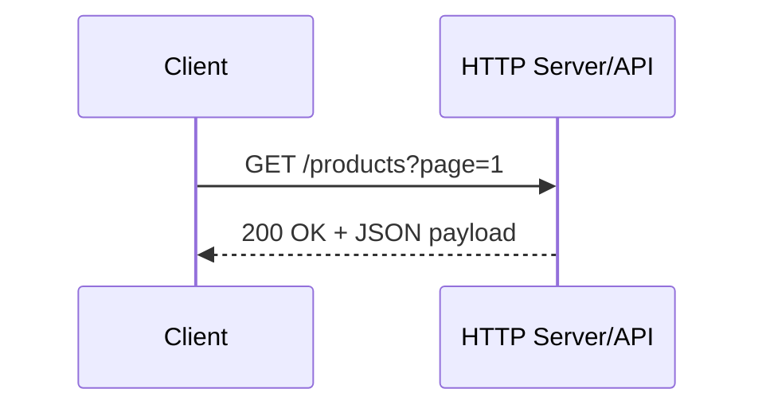
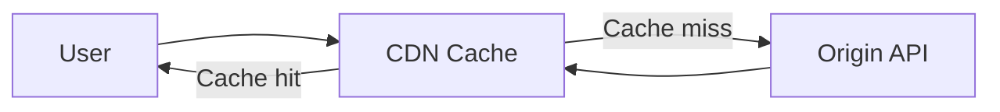

# HTTP

HTTP (Hypertext Transfer Protocol) is an application-layer protocol used for communication between clients and servers on the web.

In system design, HTTP is foundational because almost every web API, browser request, and microservice call relies on it.

## Why HTTP Matters in System Design

HTTP defines:

- how requests are sent
- how responses are returned
- how services expose contracts
- how caching, retries, and performance behaviors work

A strong system design answer should explain HTTP semantics, not just endpoints.

## Core Request-Response Model

HTTP is stateless at protocol level. Each request contains enough information for the server to process it.

Basic flow:

1. Client opens connection to server.
2. Client sends HTTP request (method, URL, headers, body).
3. Server processes request.
4. Server returns HTTP response (status, headers, body).

## HTTP Message Structure

### Request

- Method: GET, POST, PUT, PATCH, DELETE
- URL: resource path and query string
- Headers: metadata (authorization, content type, cache directives)
- Body: payload for write operations

### Response

- Status code: result category
- Headers: caching, content type, compression, cookies
- Body: data or error details

## Common HTTP Methods

- GET: retrieve resource (safe, idempotent)
- POST: create/trigger operation (not idempotent by default)
- PUT: full update/replace (idempotent)
- PATCH: partial update
- DELETE: remove resource (usually idempotent)

Method semantics are important for retries and client behavior.

## Status Codes You Must Know

- 2xx success: 200, 201, 204
- 3xx redirect: 301, 302, 304
- 4xx client errors: 400, 401, 403, 404, 409, 429
- 5xx server errors: 500, 502, 503, 504

System design interviews often check whether you use these correctly.

## Statelessness and Horizontal Scaling

Because HTTP requests are independent, servers can scale horizontally behind a load balancer.

If session state is needed, store it in:

- token/JWT on client
- distributed cache (Redis)
- database-backed session store

Avoid sticky sessions unless truly needed.

## Caching with HTTP

HTTP has built-in caching support:

- Cache-Control
- ETag / If-None-Match
- Last-Modified / If-Modified-Since

Caching reduces backend load and latency.

## Timeouts, Retries, and Idempotency

Distributed systems need failure handling:

- client timeout boundaries
- retry with exponential backoff
- idempotency keys for safe retry of create operations

For non-idempotent operations, retries can duplicate side effects unless protected.

## HTTP and APIs

HTTP is commonly used with REST-style APIs:

- resource-oriented URLs
- method-based action semantics
- predictable status codes

Also common with RPC-over-HTTP and GraphQL-over-HTTP.

## Performance Topics

- Keep-Alive and connection reuse
- compression (gzip, brotli)
- pagination for large datasets
- payload minimization
- HTTP/2 multiplexing and header compression

These decisions directly impact throughput and latency.

## Security Considerations

Plain HTTP is not encrypted.

Sensitive data over HTTP can be intercepted or modified. In production, use HTTPS for:

- transport encryption
- certificate-based server identity
- message integrity

## Common System Design Scenarios

### 1. Public API Gateway

- clients call gateway via HTTP(S)
- gateway handles auth, rate limits, routing

### 2. Internal Service-to-Service Calls

- HTTP/JSON between microservices
- retries and circuit breakers for resilience

### 3. Large Content Delivery

- static assets served via CDN
- cache headers tuned for update frequency

## Common Mistakes

- using POST for everything
- ignoring status code semantics
- no timeout/retry policy
- no pagination for list endpoints
- returning huge uncompressed payloads

## Interview Framing

A complete HTTP design explanation should include:

1. request-response model
2. method and status code semantics
3. stateless scaling strategy
4. caching approach
5. resiliency strategy (timeouts, retries, idempotency)
6. security baseline (move to HTTPS)

## Summary

HTTP is the core communication protocol for modern distributed systems. Understanding its semantics, performance controls, and resilience patterns is essential for designing scalable and reliable services.
