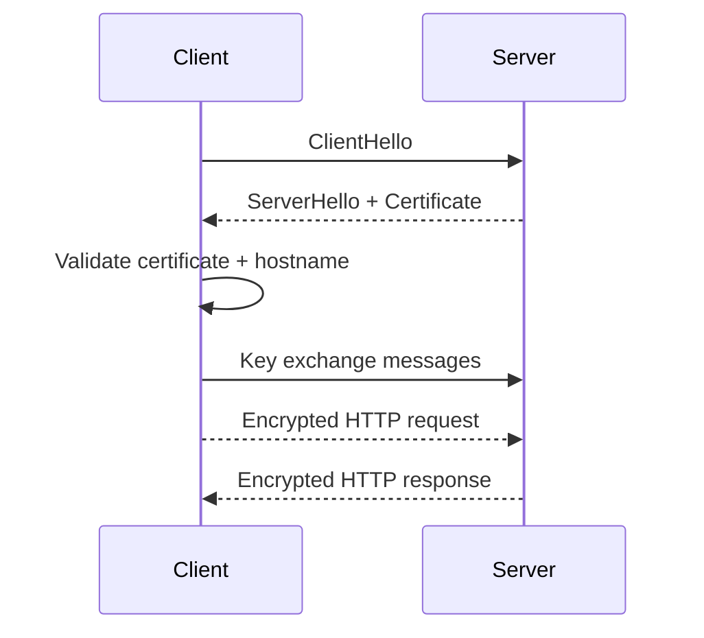

# HTTPS

HTTPS (Hypertext Transfer Protocol Secure) is HTTP running over TLS. It provides encryption, server authentication, and message integrity.

In system design, HTTPS is the baseline for secure communication between browsers, mobile apps, APIs, and services.

## Why HTTPS Is Critical

Without HTTPS, attackers can:

- read traffic in transit
- modify responses
- impersonate servers in man-in-the-middle attacks

HTTPS protects confidentiality, integrity, and authenticity for transport.

## HTTP vs HTTPS

- HTTP: plaintext transport
- HTTPS: encrypted transport using TLS

Applications still use HTTP semantics (methods, headers, status codes), but the transport channel is secured.

## TLS Handshake (High Level)

1. Client connects and sends supported TLS versions/ciphers.
2. Server returns certificate and selected cipher suite.
3. Client validates certificate chain and hostname.
4. Key exchange establishes shared session keys.
5. Encrypted application data starts.

## Certificates and Trust

A certificate binds a domain name to a public key.

Trust works through certificate authorities (CAs):

- browser/OS trusts a CA root
- CA signs intermediate certs
- intermediates sign server cert

If validation fails, clients should reject connection.

## Where TLS Terminates

In many architectures, TLS terminates at:

- CDN edge
- load balancer
- API gateway

Then traffic may continue as TLS or internal HTTP depending on security requirements.

## Key System Design Decisions

### 1. End-to-End Encryption

Decide whether traffic remains encrypted after edge termination.

- internet-only encryption may be insufficient for strict compliance
- internal TLS (mTLS) improves zero-trust posture

### 2. Certificate Lifecycle

Plan for:

- automated issuance/renewal
- certificate rotation
- monitoring expiration

Expired certificates cause outages.

### 3. Cipher and Protocol Policy

- disable old protocols and weak ciphers
- enforce TLS 1.2+ (or 1.3 where possible)

### 4. HSTS

HTTP Strict Transport Security forces clients to use HTTPS and reduces downgrade attacks.

## Performance Considerations

TLS adds handshake overhead, but modern optimizations reduce impact:

- session resumption
- TLS 1.3 fewer round trips
- HTTP/2 multiplexing
- CDN edge termination close to users

Security and performance can coexist with proper architecture.

## mTLS for Service-to-Service

Mutual TLS (mTLS) authenticates both client and server.

Useful for:

- microservice identity
- service mesh security
- preventing unauthorized internal calls

## Common Threats Mitigated

- sniffing on open networks
- MITM tampering
- spoofed servers (when cert validation is correct)

Not fully solved by HTTPS alone:

- app-layer auth flaws
- XSS/CSRF bugs
- compromised endpoints

## Observability and Operations

Track:

- TLS handshake failures
- certificate expiry windows
- protocol/cipher usage
- latency impact per region

Operational visibility prevents security outages.

## Common Mistakes

- serving mixed content (HTTPS page with HTTP assets)
- ignoring cert expiration monitoring
- terminating TLS too early without internal protection
- weak TLS policy kept for legacy clients without risk controls

## Interview Framing

A strong HTTPS system design answer should cover:

1. TLS handshake and certificate validation
2. termination points and trust boundaries
3. certificate management automation
4. protocol/cipher hardening
5. performance and scaling tradeoffs
6. internal service security (mTLS)

## Summary

HTTPS is the secure transport foundation for web-scale systems. In system design, it is not only about encryption but also trust boundaries, certificate operations, and resilient, performant deployment patterns.
