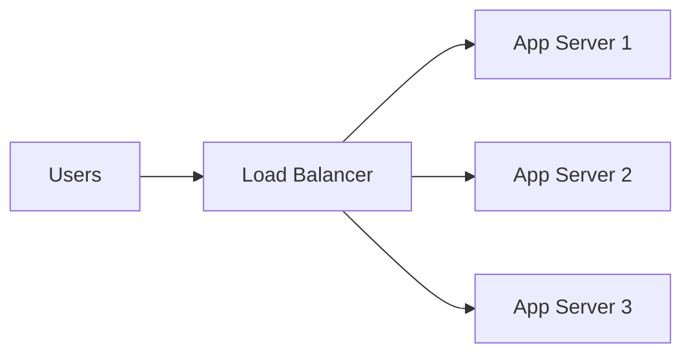
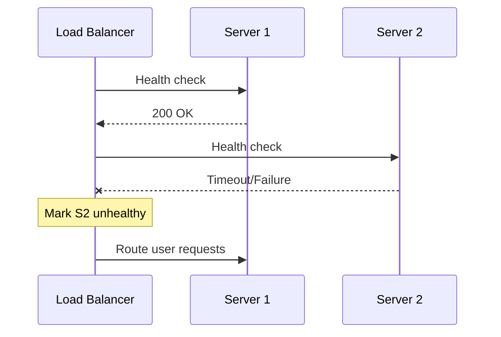
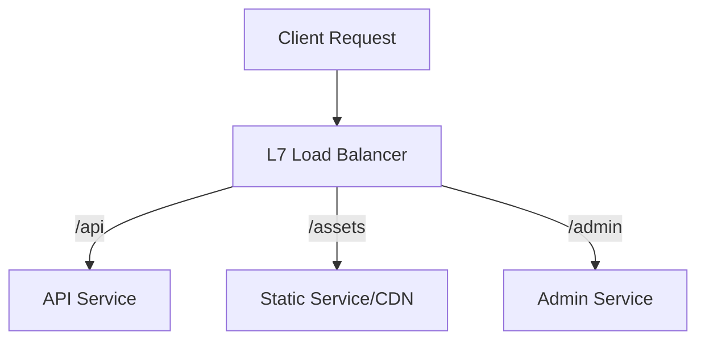

# Load Balancer

A load balancer distributes incoming traffic across multiple backend servers to improve availability, scalability, and performance.

In system design, load balancing is a core building block for highly available and horizontally scalable applications.

## Why Load Balancers Matter

Without a load balancer:

- one server becomes a bottleneck
- server failure can cause full outage
- scaling requires manual traffic reconfiguration

With a load balancer:

- traffic is shared across instances
- unhealthy instances can be removed automatically
- new instances can be added with minimal client impact

## Core Flow

The load balancer receives requests and forwards each one using a balancing algorithm.

## L4 vs L7 Load Balancing

### Layer 4 (Transport)

Balances at TCP/UDP level using IP and port.

Pros:

- lower overhead
- very high throughput

Cons:

- no HTTP-aware routing (path/header/cookie rules)

### Layer 7 (Application)

Balances at HTTP/HTTPS level.

Pros:

- path-based routing (`/api`, `/images`)
- header/cookie-based routing
- TLS termination and advanced policies

Cons:

- more processing overhead

In modern web apps, L7 is common at ingress; L4 may still be used for raw performance or non-HTTP protocols.

## Common Load Balancing Algorithms

### 1. Round Robin

Requests distributed in sequence.

- simple
- good for similar-capacity servers

### 2. Least Connections

Send traffic to instance with fewest active connections.

- useful when request duration varies

### 3. Weighted Round Robin

Instances with higher capacity get larger share.

- good for mixed instance sizes

### 4. IP Hash

Maps client IP consistently to same backend.

- helps with session affinity scenarios

No single algorithm is always best; choice depends on traffic and workload behavior.

## Health Checks and Failover

Load balancers continuously probe backends (HTTP endpoint or TCP probe).

If backend is unhealthy:

- it is removed from rotation
- traffic is sent only to healthy instances

Health checks are critical for automatic self-healing.

## Session Affinity (Sticky Sessions)

Sticky sessions route a user repeatedly to the same backend.

Useful when state is in-memory on app nodes.

Tradeoffs:

- uneven load distribution
- harder autoscaling and failover

Preferred approach in scalable design:

- keep app stateless
- move session/state to shared store (Redis, DB)

## TLS Termination

Load balancer often terminates TLS:

- decrypts incoming HTTPS
- forwards traffic internally (HTTP or HTTPS)

Benefits:

- centralized cert management
- offload crypto from app nodes

For stricter security, re-encrypt traffic to backend.

## Advanced Routing Patterns

L7 load balancers can enable:

- path-based routing (`/api` -> service A)
- host-based routing (`admin.example.com` -> admin service)
- canary rollout (5% to new version)
- blue-green switchovers

## Global vs Regional Load Balancing

### Regional LB

Distributes traffic across instances inside one region.

### Global LB

Routes users to best region based on:

- latency
- geography
- health

Typical architecture uses both:

- global front door -> regional load balancer -> service instances

## Load Balancer in Microservices

There are multiple balancing layers:

- north-south traffic: internet to platform ingress
- east-west traffic: service-to-service routing

Service meshes and internal discovery mechanisms may provide additional balancing for internal calls.

## Capacity and Scaling Considerations

You must scale the load balancer tier too.

Important dimensions:

- connections per second
- requests per second
- TLS handshake rate
- bandwidth throughput

Use managed LB services or HA pair setups to avoid LB as single point of failure.

## Observability and SLO Impact

Track:

- request rate, latency, error rate
- backend health status
- connection saturation
- 4xx/5xx distributions
- rejected connections due to limits

Load balancer metrics are early indicators of cascading failures.

## Security Controls at LB Layer

Load balancers often integrate with:

- WAF policies
- rate limiting
- IP allow/deny rules
- bot and DDoS mitigation

This reduces pressure on backend services and improves security posture.

## Common Mistakes

- no health checks or weak health endpoint design
- sticky sessions with stateful app nodes at scale
- single load balancer instance without HA
- no timeout/retry policy between LB and backend
- ignoring connection draining during deployments

## Interview Framing (Medium Level)

For a medium-level load balancer design answer, cover:

1. where LB sits in request path
2. L4 vs L7 selection and why
3. algorithm choice with workload assumptions
4. health checks and failover behavior
5. session strategy (stateless preferred)
6. TLS termination and security controls
7. multi-region routing and observability

## Summary

Load balancers are essential for resilient and scalable systems. Strong design requires not just traffic distribution, but also health management, security policy, deployment safety, and clear latency/availability tradeoff decisions.
