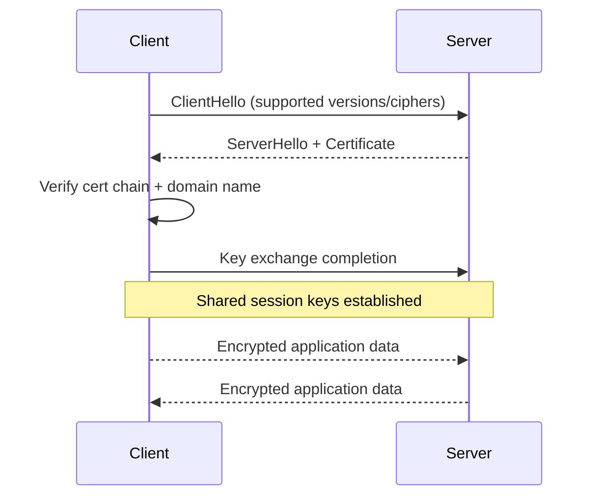
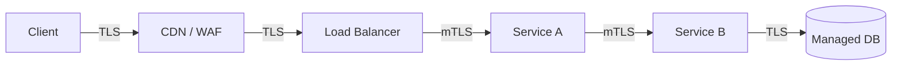

# SSL/TLS

SSL/TLS refers to transport-layer security protocols used to secure communication over networks.

In modern systems, TLS is the active standard (SSL is obsolete), but people still commonly say SSL/TLS in interviews and architecture discussions.

## Why SSL/TLS Matters in System Design

Distributed systems constantly exchange sensitive data:

- user credentials
- tokens and cookies
- payment and profile data
- internal service messages

SSL/TLS provides:

- confidentiality (encryption)
- integrity (tamper detection)
- authentication (server identity, optionally client identity)

## SSL vs TLS

- SSL 2.0/3.0: deprecated and insecure
- TLS 1.0/1.1: legacy, often disabled
- TLS 1.2/1.3: current secure standards

In design conversations, say you will enforce TLS 1.2+ and prefer TLS 1.3.

## How TLS Works (Conceptual)

TLS has two phases:

1. Handshake: negotiate algorithms, authenticate server, establish keys.
2. Record protocol: encrypt application data with symmetric session keys.

Symmetric crypto is used for speed after secure key agreement.

## Handshake Simplified

## Certificates and PKI

A TLS certificate includes:

- subject (domain)
- public key
- issuer (CA)
- validity period

Validation checks:

- certificate chain trust
- expiration
- hostname match
- revocation status (when applicable)

If validation fails, secure clients should fail the connection.

## Where SSL/TLS Is Applied in Architecture

### 1. Client to Edge

- browser/mobile app to CDN or load balancer

### 2. Edge to Origin

- load balancer to app service

### 3. Service to Service

- internal APIs secured with TLS or mTLS

## TLS Termination Strategy

You must define trust boundaries:

- terminate only at edge (simpler, less secure internally)
- re-encrypt to backend (better defense)
- end-to-end encryption (strongest for compliance)

This is a core system design decision.

## mTLS (Mutual TLS)

In mTLS, both sides present certificates.

Benefits:

- strong service identity
- blocks unauthorized east-west traffic
- useful in zero-trust environments and service meshes

Challenges:

- certificate issuance and rotation at scale
- operational complexity

## Performance Considerations

TLS adds CPU and latency during handshake.

Mitigation strategies:

- TLS 1.3
- session resumption
- keep-alive and connection pooling
- hardware acceleration / optimized load balancers
- edge termination via CDN

Well-designed systems keep TLS overhead low.

## Key Management and Rotation

System design should include:

- automated certificate renewal
- private key protection (HSM/KMS)
- secret distribution controls
- emergency revocation and replacement process

Security failures are often operational, not cryptographic.

## Common Attack Classes and Defenses

- MITM interception: prevented by correct cert validation
- downgrade attacks: prevent via strong protocol policy and HSTS
- weak cipher exploitation: disable insecure suites
- certificate misuse: enforce lifecycle governance

## Practical Cloud Considerations

- Use managed certificate services when possible.
- Automate renewals to avoid expiration incidents.
- Define TLS policy centrally at ingress gateways.
- Monitor handshake errors and cert expiry alerts.

## Common Mistakes

- saying SSL when actually requiring TLS 1.2/1.3
- allowing legacy ciphers for convenience
- missing cert expiration monitoring
- no internal encryption for sensitive service traffic
- storing private keys insecurely

## Interview Framing

For SSL/TLS system design questions, structure your answer as:

1. threat model and data sensitivity
2. protocol baseline (TLS 1.2/1.3)
3. certificate trust model and validation
4. termination points and internal trust boundaries
5. mTLS for service identity
6. operational controls (rotation, monitoring, incident response)

## Summary

SSL/TLS is the transport security backbone of modern distributed systems. A good system design answer goes beyond encryption basics and covers trust boundaries, certificate operations, performance tradeoffs, and internal service identity.
