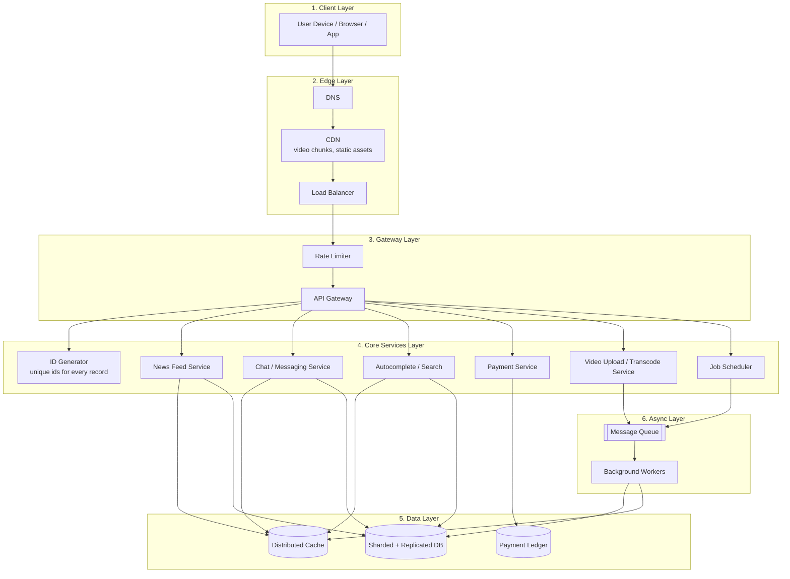
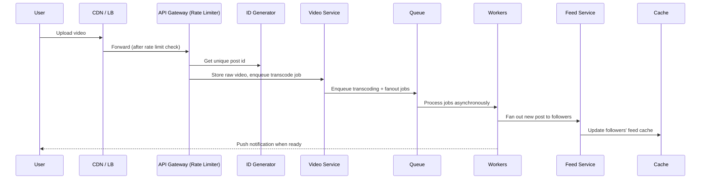

# System Design Big Picture (All Topics in One Diagram)

Each system design topic in this guide (rate limiting, caching, chat, feeds, id generation, video streaming, job scheduling, autocomplete, payments) is usually taught as a separate problem. In a real product, they all work together as layers in one request path.

This page gives one simple, unified diagram showing where each concept fits, so you can see the "big picture" before diving into any single topic.

## 1. The Unified Architecture

## 2. How to Read This Map

Follow one request through the layers, left to right, top to bottom:

1. **Client Layer** — the user's device makes a request (open the app, type a search, send a message).
2. **Edge Layer** — [DNS](dns-system-design.md) resolves the domain, a [CDN](design-url-shortner-system-design.md) serves cached static/video content close to the user, and a [Load Balancer](load-balancer-system-design.md) spreads traffic across servers.
3. **Gateway Layer** — every request passes through a [Rate Limiter](design-rate-limiter-system-design.md) before hitting the API Gateway, protecting every service behind it from overload.
4. **Core Services Layer** — the actual feature logic lives here: [News Feed](design-news-feed-system-design.md), [Chat](design-chat-application-system-design.md), [Autocomplete](design-search-autocomplete-system-design.md), [Payments](design-payment-system-system-design.md), [Video Streaming](design-video-streaming-system-design.md), and the [Job Scheduler](design-job-scheduler-system-design.md). Every new record created anywhere in this layer gets a unique id from the [Distributed ID Generator](distributed-id-generator-system-design.md).
5. **Data Layer** — services read/write through a [Distributed Cache](design-distributed-cache-system-design.md) first, falling back to a [sharded, replicated database](db-sharding-system-design.md), while payments additionally write to an immutable ledger for auditability.
6. **Async Layer** — slow or non-urgent work (video transcoding, scheduled jobs, feed fanout, notifications) is pushed to a queue and processed by background workers, keeping the request path fast.

## 3. Why One Request Touches Many Boxes

Take "a user posts a video" as an example:

Every "advanced" system design topic is really just one specialized box in this same overall shape — that's why interviewers can ask about any of them individually, but they all reuse the same building blocks: edge caching, rate limiting, a fast data layer, and an async queue for anything that doesn't need to happen instantly.

## 4. Quick Reference Table

| Layer | Purpose | Example Topic Pages |
|---|---|---|
| Edge | Get requests to the right place fast | [DNS](dns-system-design.md), [Load Balancer](load-balancer-system-design.md), [HTTPS](https-system-design.md) |
| Gateway | Protect services from overload | [Rate Limiter](design-rate-limiter-system-design.md) |
| Core Services | Feature-specific business logic | [News Feed](design-news-feed-system-design.md), [Chat](design-chat-application-system-design.md), [Autocomplete](design-search-autocomplete-system-design.md), [Payments](design-payment-system-system-design.md), [Video Streaming](design-video-streaming-system-design.md), [Job Scheduler](design-job-scheduler-system-design.md) |
| Identity | Give every record a unique id | [Distributed ID Generator](distributed-id-generator-system-design.md) |
| Data | Store and serve data fast | [Distributed Cache](design-distributed-cache-system-design.md), [DB Sharding](db-sharding-system-design.md), [DB Replication](db-replication-system-design.md), [DB Indexing](db-indexing-system-design.md) |
| Async | Do slow work without blocking users | Message queues + background workers (used by Video, Scheduler, Feed fanout) |

## 5. Summary

Almost every advanced system design question is a variation on the same five layers: edge, gateway, core services, data, and async processing. Once you recognize this shape, learning a new topic becomes "which layer does this problem live in, and what's special about it here?" instead of memorizing unrelated designs from scratch.
