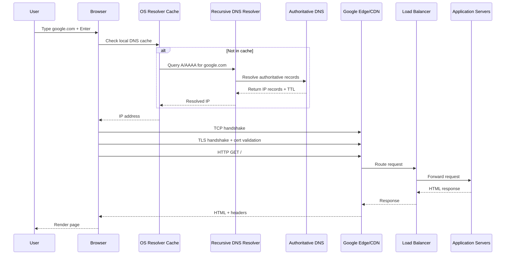

# What Happens When You Type google.com

This is one of the most common system design interview questions because it covers networking, distributed systems, security, and browser internals.

## High-Level Journey

When you type google.com and press Enter, your system performs:

1. URL processing in browser
2. DNS lookup to resolve domain to IP
3. TCP and TLS connection setup
4. HTTP request to Google infrastructure
5. traffic routing through edge/CDN/load balancers
6. backend processing and response generation
7. browser parsing, rendering, and resource loading

## End-to-End Architecture Flow

## Step-by-Step Detail

## 1. Browser Input Handling

Browser first interprets your input:

- determines if it is URL or search text
- applies default scheme (https)
- checks HSTS preload and previous security rules

For google.com, browser typically navigates to https://www.google.com or region-specific endpoint.

## 2. DNS Resolution

The browser needs IP address for the domain.

Resolution path:

- browser DNS cache
- OS DNS cache
- router or ISP recursive resolver
- root -> TLD -> authoritative DNS chain (logically)

Resolver returns:

- one or more IP addresses
- TTL (how long cache is valid)

## 3. Connection Establishment

After IP is known:

- TCP 3-way handshake starts (SYN, SYN-ACK, ACK)
- for HTTPS, TLS handshake follows

TLS handshake includes:

- certificate exchange
- certificate chain validation
- key agreement
- encrypted session setup

If TLS validation fails, browser blocks/warns.

## 4. HTTP Request Sent

Browser sends request like:

- method: GET
- path: /
- host header: google.com
- user-agent and accept headers
- cookies (if previously set)

In modern browsers, HTTP/2 or HTTP/3 may be used depending on support.

## 5. Global Routing and Edge Handling

At internet scale, request usually reaches nearest edge point.

Edge layer may do:

- DDoS filtering
- TLS termination
- cache checks
- routing to healthy backend region

This reduces latency and improves resilience.

## 6. Load Balancing and Backend Processing

Inside provider network:

- load balancer selects backend service instances
- backend services process request
- supporting systems may include auth, personalization, ranking, logging

Even a simple homepage can involve many microservices.

## 7. Response Returned

Server responds with:

- HTML
- headers (cache-control, security headers, cookies)
- possible redirects

Browser receives first byte and starts parsing immediately.

## 8. Browser Rendering Pipeline

Browser then:

1. parses HTML to DOM
2. fetches linked CSS/JS/images/fonts
3. builds CSSOM
4. executes JavaScript
5. computes layout
6. paints pixels to screen

Critical resources can block render if not optimized.

## 9. Additional Background Work

After first render, browser may continue:

- prefetch DNS/resources
- open additional connections
- lazy-load scripts/images
- track performance metrics

## System Design Concepts Hidden in This Question

This question tests understanding of:

- caching layers (browser, DNS, CDN)
- latency optimization
- horizontal scaling and load balancing
- fault tolerance and regional failover
- security (TLS, cert validation, secure headers)
- stateless request handling and distributed architecture

## Common Failure Points

- DNS failure or stale resolver cache
- TLS certificate mismatch/expiration
- network packet loss or routing issues
- overloaded region or backend service
- JavaScript/CSS resource blocking render

Large systems use retries, failover, and health checks to reduce impact.

## Real-World Optimization Techniques

- DNS geo-routing
- Anycast edge routing
- CDN content caching
- compressed responses (gzip/br)
- keep-alive and connection reuse
- HTTP/2 multiplexing or HTTP/3 QUIC
- browser-side caching with proper headers

## Interview Tip

For this question, explain from user action to pixel rendering in layers:

- client
- network
- edge
- backend
- browser render

A layered explanation is clearer than focusing only on DNS.

## Summary

Typing google.com triggers a distributed workflow across browser internals, DNS infrastructure, secure transport, global edge routing, backend services, and rendering engines. Understanding this flow demonstrates strong system design fundamentals across networking, scalability, and reliability.
