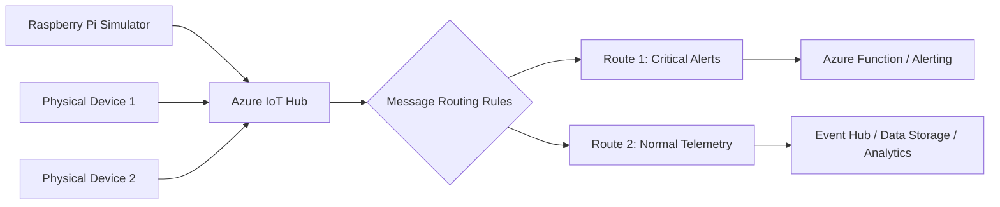

## Azure IoT Hub

Azure IoT Hub is designed specifically for securely connecting, monitoring, and managing IoT devices.

### Devices
- Each device is registered in IoT Hub (identity + authentication).
- Devices send telemetry (temperature, pressure, location, etc.).
- IoT Hub supports cloud-to-device and device-to-cloud messaging.

### Message Routing
- IoT Hub can route messages based on conditions.
- Example: route critical temperature alerts to one endpoint, normal telemetry to another.
- Routes can send data to services like Event Hubs, Service Bus, Storage, Functions, etc.

### Raspberry Pi IoT Simulator
- If you do not have physical hardware, use a **Raspberry Pi IoT Simulator**.
- It simulates sensor telemetry and sends messages to IoT Hub.
- Good for demos, testing, and learning.

### IoT Hub Architecture (Simple)

---

## Real-World Scenario

### Cold Chain Monitoring for Pharmaceuticals

A pharma logistics company transports temperature-sensitive medicines.

How IoT Hub helps:
- Sensors in refrigerated trucks send temperature and humidity telemetry.
- IoT Hub authenticates each device and receives data securely.
- Message routing sends normal telemetry to storage/analytics.
- Critical temperature breach events are routed to a real-time alert function.
- Operations teams are notified immediately to prevent spoilage.

This setup reduces medicine loss and supports compliance reporting.
